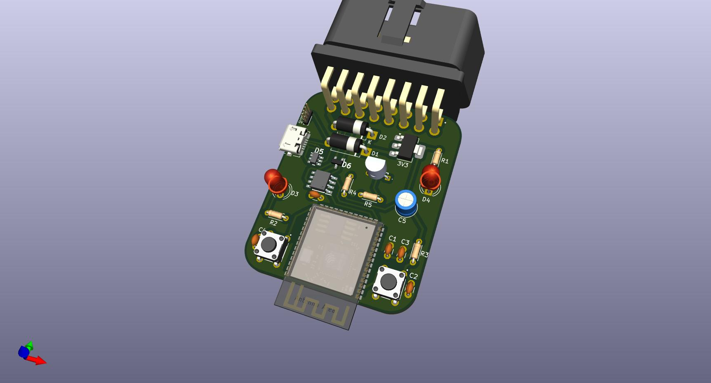

## Proiect Robotica - Control OBD2 cu ESP32 si Android

### Descriere

In acest proiect am decis sa realizez un PCB printat de dimensiuni reduse care sa poata fi conectat la un conector OBD2 si sa poata comunica cu un modul de tip CAN transciever. Acest PCB va fi controlat de un microcontroller ESP32 care va comunica cu un dispozitiv Android prin intermediul Bluetooth. Aplicatia Android va putea sa citeasca informatii de la masina si sa trimita comenzi catre aceasta.
Folosind liniile CAN High si CAN Low ale portului OBD2 avem acces la o varietate de informatii despre starea curenta a autovehiculului dar si la posibilitatea de a trimite comenzi limitate catre acesta.

### *Hardware Design*

#### Componente

- [ESP32-S3-WROOM-1](https://www.espressif.com/sites/default/files/documentation/esp32-s3-wroom-1_wroom-1u_datasheet_en.pdf)
- [LM1117 Linear Regulator](https://www.ti.com/lit/ds/symlink/lm1117.pdf)
- [MAX3051 3.3V CAN Transciever](https://www.analog.com/media/en/technical-documentation/data-sheets/max3051.pdf)
- [CAN bus ESD protection diode](https://assets.nexperia.com/documents/data-sheet/PESD2CAN.pdf)
- [Micro USB ESD protection](https://datasheet.datasheetarchive.com/originals/distributors/Datasheets-DGA26/1842016.pdf)
- OBD2 Connector
- Micro USB B Connector
- Tranzistor BJT NPN 2N2222A
- Rezistente, condensatori, diode, etc.

#### Schema electrica

[ESP32-WROOM-CAN.pdf](./res/ESP32-WROOM-CAN.pdf)

#### PCB

### *Software Design*

#### Mediu de dezvoltare

- [PlatformIO](https://platformio.org/)
- [VSCode](https://code.visualstudio.com/)